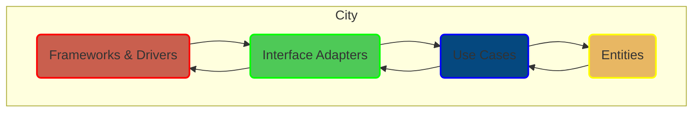

Sure! Let's explain Clean Architecture using the concept of a city, which makes it easier to understand. We'll then relate it to how you might work with Node.js in software development. Finally, I'll provide a mermaid diagram to illustrate the architecture.

### Clean Architecture Concept: A City Metaphor

Imagine a city with different zones and layers:

1. **City Center (Entities)**:
   - This is the core of the city where the most important buildings are located, like the town hall, main library, and central park. These are the entities, representing the core business logic and rules that remain unchanged no matter what happens outside.

2. **Business District (Use Cases)**:
   - Surrounding the city center is the business district. Here, you have various businesses like shops, offices, and service centers that interact with the city center. In Clean Architecture, these are the use cases, which define the application’s business rules. They manage the flow of data to and from the entities.

3. **Suburbs (Interface Adapters)**:
   - Outside the business district, you have the suburbs. These areas have schools, houses, and local stores that interface between the core of the city and the external world. In Clean Architecture, these are the interface adapters, which convert data from the outside world to a format that the use cases and entities understand, and vice versa.

4. **City Gates (Frameworks and Drivers)**:
   - Finally, you have the city gates, like highways and train stations, which control how people enter and leave the city. These represent the frameworks and drivers in Clean Architecture, such as the web server, database, and UI, which are the outermost layer. They handle the actual input/output operations and interact with the interface adapters.

### Applying Clean Architecture in Node.js

When building an application in Node.js, you might structure your project to reflect this city layout:

1. **Entities**:
   - These are plain JavaScript classes or data structures. For example, a `User` class with properties like `id`, `name`, and `email`, and methods that enforce business rules.

2. **Use Cases**:
   - These are service classes or functions that handle the business logic. For instance, a `RegisterUser` use case that takes user details, validates them, and then saves the user.

3. **Interface Adapters**:
   - These include repositories (e.g., `UserRepository`), controllers, and presenters. They convert data formats and handle communication between use cases and the outside world. For example, an Express controller that receives an HTTP request, extracts the necessary data, and calls the use case.

4. **Frameworks and Drivers**:
   - These are the actual implementations of web servers (e.g., Express), databases (e.g., MongoDB, PostgreSQL), and other frameworks. They interact with the interface adapters but are kept separate from the core business logic.

### Mermaid Diagram

Here’s a mermaid diagram to visualize Clean Architecture:

### Summary

- **Entities (City Center)**: Core business rules and data.
- **Use Cases (Business District)**: Application-specific business logic.
- **Interface Adapters (Suburbs)**: Converters between external data and internal representations.
- **Frameworks & Drivers (City Gates)**: External systems like web servers and databases.

This structure helps in making sure that your application is modular, scalable, and easy to maintain, just like a well-organized city.